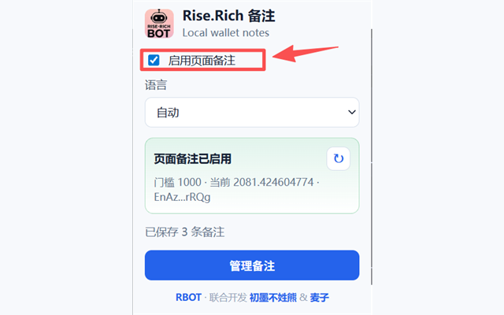
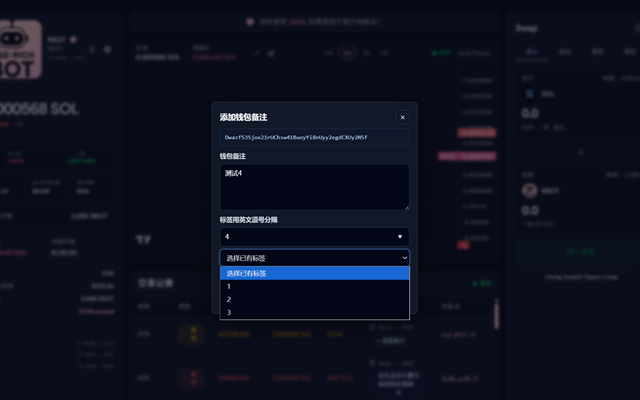
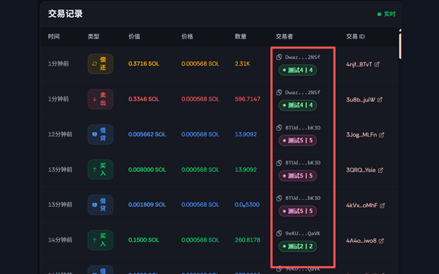

# Rise.Rich Local Remarks

Rise.Rich Local Remarks is a Manifest V3 Chrome extension that adds local wallet notes, tags, and quick actions to rise.rich pages.

中文简介：Rise.Rich Local Remarks 是一个用于 rise.rich 页面的 Chrome 插件，可以为钱包地址添加本地备注、标签和快捷操作，并通过 Solana RPC 验证 RBOT 代币门槛。

## Features

- Add and edit local notes for wallet addresses on rise.rich.
- Assign tags and reuse existing tags from the note dialog.
- Show saved notes and tags directly in supported rise.rich views.
- Import and export notes as JSON.
- Verify RBOT token-gate eligibility through Solana RPC.
- Configure a custom HTTPS Solana RPC endpoint.

## 功能

- 在 rise.rich 页面为钱包地址添加和编辑本地备注。
- 为钱包备注添加标签，并在备注弹窗中复用已有标签。
- 在支持的 rise.rich 页面直接显示已保存的备注和标签。
- 支持备注数据的 JSON 导入和导出。
- 通过 Solana RPC 验证 RBOT 代币门槛。
- 支持配置自定义 HTTPS Solana RPC 节点。

## Screenshots / 截图







## Privacy

Notes and tags are stored locally in Chrome with `chrome.storage.local`. They are not uploaded to developer-controlled servers.

The extension reads wallet addresses displayed on rise.rich pages so it can show local notes and quick actions. For RBOT token-gate verification, the detected wallet address and RBOT mint are sent to the configured Solana RPC endpoint.

See [PRIVACY.md](./PRIVACY.md) for the full policy.

## 隐私说明

备注和标签会通过 `chrome.storage.local` 保存在用户本地 Chrome 浏览器中，不会上传到开发者服务器。

插件会读取 rise.rich 页面中显示的钱包地址，用于展示本地备注、标签和快捷操作。为了验证 RBOT 代币门槛，插件会将检测到的钱包地址和 RBOT mint 发送到配置的 Solana RPC 节点。

完整隐私政策见 [PRIVACY.md](./PRIVACY.md)。

## Development

Run the test suite:

```powershell
npm.cmd test
```

Create a Chrome Web Store package:

```powershell
npm.cmd run package:webstore
```

The packaged ZIP is written to `dist/`.

## Chrome Installation For Testing

1. Open `chrome://extensions/`.
2. Enable Developer mode.
3. Click Load unpacked.
4. Select this project folder.

## License

MIT
